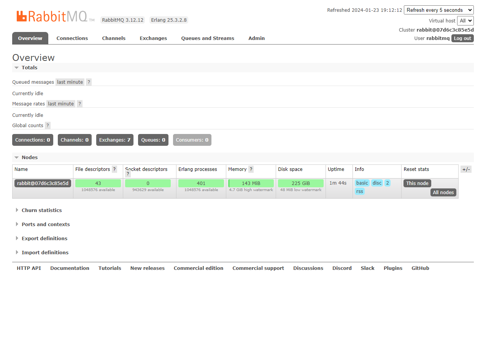

# RabbitMQ

## Subjects studied
- [x] Multiplexing connections
- [x] Publisher
- [x] Consumer
- [x] Queue (FIFO)
  - [x] Bind
  - [x] Routing key
  - [x] Properties
    - [x] Durable
    - [x] Auto-delete
    - [x] Expiry
    - [x] Expiry
    - [x] Message TTL
    - [x] Overflow
      - [x] Drop head
      - [x] Reject publish
    - [x] Exclusive
    - [x] Max length/bytes
  - [x] Dead letter queues
  - [x] Lazy queues
- [x] Exchange
  - [x] Direct
  - [x] Fanout
  - [x] Topic
  - [x] Headers
- [x] [Simulation](https://tryrabbitmq.com/)
- [x] Consumer acknowledgment
  - [x] Basic.Ack 
  - [x] Basic.Reject 
  - [x] Basic.Nack 
- [x] Publisher confirm

## How to Run

Execute the `docker compose up` command inside `rabbitmq` directory to run the UI and access it via `http://localhost:15672/`

## UI

